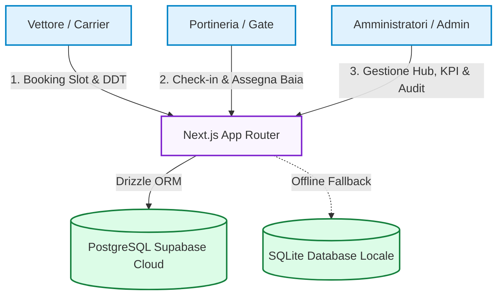
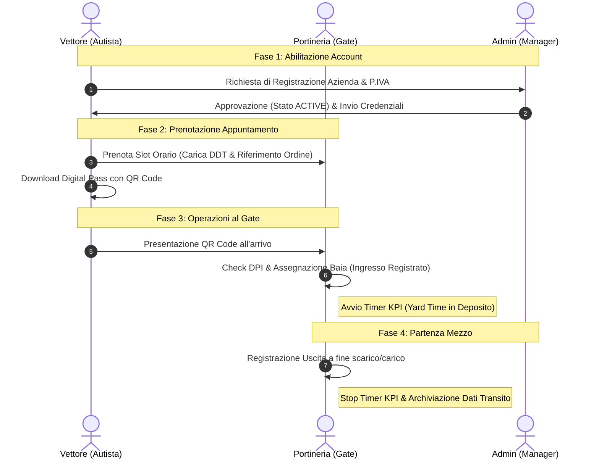

# 📦 LOGIBOOK - Project Presentation & Roadmap

> **Ecosistema di Gestione e Prenotazione Slot**  
> *L'efficienza del magazzino comincia dal cancello d'ingresso*

**LogiBook** (in precedenza Slotify) è la nuova piattaforma enterprise progettata per ottimizzare la pianificazione e il transito dei mezzi nei depositi.

## 🎯 Obiettivi e Target

- **Obiettivo principale**: Ridurre al minimo i tempi di attesa dei vettori ed eliminare le code ai cancelli tramite la digitalizzazione.
- **Target di Utilizzo**:
  - 🚚 **Vettori**: Prenotano gli slot in autonomia caricando la documentazione di viaggio (DDT).
  - 🏢 **Portineria (Gate)**: Monitora live gli arrivi, registra ingressi/uscite e assegna le baie.
  - 👑 **Amministratori**: Gestiscono le utenze, verificano i KPI prestazionali e controllano i log di audit.

---

## 🏗️ Architettura Cloud-Native
*Infrastruttura dati scalabile, resiliente e protetta*

**Caratteristiche Tecniche:**
*   **Database Cloud PostgreSQL**: Ospitato su Supabase per garantire ridondanza, elevata frequenza di transazioni simultanee e backup automatici.
*   **Tracciabilità Integrata**: Ogni modifica è soggetta ad audit log asincroni non bloccanti.

---

## 🔄 Ciclo di Vita del Transito
*Flusso operativo end-to-end del mezzo di trasporto*

---

## ✅ Stato Avanzamento (Features Pronte)
*Cosa è stato già completato e integrato nella V1*

| Area Funzionale | Stato | Dettagli Sviluppo |
| :--- | :---: | :--- |
| **Sicurezza & Onboarding** | 🟢 Completato | Gestione richieste d'accesso vettori (`PENDING`/`ACTIVE`), login a tre ruoli e cambio password obbligatorio al primo accesso. |
| **Area Vettori (Booking)** | 🟢 Completato | Calendario slot, vincolo ore 15:00 del giorno precedente, modulo emergenza SOS e gestione avanzata combinata "ENTRAMBI" con tab dedicati. |
| **Digital Pass QR** | 🟢 Completato | Download pass digitale con QR Code generato dinamicamente per velocizzare il check-in. |
| **Admin Dashboard** | 🟢 Completato | Multi-deposito rapido, heatmap saturazione mensile con "jump-to-day", statistiche volumi bancali in tempo reale ed export report in formato CSV. |
| **Gate Live Monitor** | 🟢 Completato | Lista ingressi del giorno, timer di permanenza del mezzo al gate e stampa fogli di marcia A4. |
| **Registro Audit** | 🟢 Completato | Logging asincrono e immutabile delle modifiche ai dati con visualizzazione old/new values. |

---

## 🚀 Roadmap Futura

### 💡 Proposta: Nuovo Flusso Operativo Vettori (6 Passaggi)
Questa proposta mira a semplificare e guidare l'esperienza utente del vettore durante la prenotazione:

1. **Registrati (solo 1ª volta)**  
   Apri il portale dal QR o dal link, clicca "Registrati ora", compila i dati aziendali (P.IVA, email, cellulare) e conferma l'email cliccando il link che ricevi.
2. **Scegli data e fascia oraria**  
   Accedi e clicca "Prenota". Sul calendario seleziona il giorno e poi lo slot orario tra quelli disponibili (verde = libero, arancio = quasi pieno, rosso = pieno).
3. **Cerca l'azienda trasportata**  
   Importante: non c'è una lista già pronta. Devi digitare nella casella di ricerca le prime lettere del nome dell'azienda per cui stai consegnando (es. "FERR" -> Ferrero). Il sistema mostrerà solo le aziende con ordini attivi presso D&D.
4. **Seleziona ordini e carica DDT**  
   Apparirà la lista degli ordini disponibili. Spunta quelli che stai trasportando: vanno nel carrello "Ordini selezionati". Per ogni ordine clicca DDT e carica il documento di trasporto.
5. **Dettagli & dati autista**  
   Pedane e cartoni vengono auto-calcolati dagli ordini. Scegli il tipo pedana (EPAL, CHEP, Misto, Non conformi) e indica se c'è contrassegno. Inserisci targa, nome e cellulare dell'autista.
6. **Conferma**  
   Controlla il riepilogo nel pannello "Preview prenotazione" a destra e clicca "Rivedi e conferma". Riceverai un'email di riepilogo e nella pagina dettaglio troverai i pulsanti per avvisare l'autista.

> **📱 Avvisa l'autista con un click — SMS, WhatsApp e GPS**  
> Se hai inserito nome e cellulare dell'autista, nella pagina dettaglio prenotazione compaiono 4 pulsanti per condividere subito le informazioni con chi guida. L'autista riceve un link con data, slot orario, azienda, deposito assegnato e un pulsante GPS per la navigazione fino al cancello giusto. Nessuna app da installare. *(Supporta: SMS, WhatsApp, Posizione GPS, Calendario)*

### 🔴 Must Have (Rilascio Immediato)
- [ ] **Sostegno Multilingua (i18n)**: Traduzione del portale in Inglese, Polacco e Rumeno per autisti esteri. *(P0 - Priorità Assoluta)*
- [ ] **Validazione Targhe/IVA**: Controlli regex severi sugli input per evitare anomalie nei database.

### 🟡 Should Have (Alta Priorità)
- [ ] **Notifiche Email Automatiche**: Invio automatico del pass e del QR Code via mail alla prenotazione.
- [ ] **SMS Driver Call**: Invio automatico di un SMS all'autista per segnalare la baia libera all'ingresso.
- [ ] **Gestione Anagrafiche da UI**: Pannello Admin per aggiungere/rimuovere Baie e Hub in autonomia.

### 🟢 Could Have (Visione Futura - V2)
- [ ] **Yard Management Screen**: Monitor piazzale esterno per la chiamata dei camion in attesa.
- [ ] **Webhook API WMS/ERP**: Integrazione automatica con i sistemi gestionali del magazzino.

### ⚪ Won't Have (Fuori Scope Attuale)
- [ ] **Integrazione OCR Gate**: Telecamere di lettura targa all'ingresso per check-in automatico.

---

## 📄 Documentazione di Supporto
Per ulteriori dettagli sull'applicazione e sulle specifiche di progetto, consultare i seguenti file:
*   [Funzionalità di LogiBook](file:///c:/Users/AlessandroBaiamonte/Desktop/progetto%20slotify/FUNZIONALITA_LOGIBOOK.txt) — Specifiche dettagliate dei moduli di sistema.
*   [Valutazione Economica](file:///c:/Users/AlessandroBaiamonte/Desktop/progetto%20slotify/valutazione_economica.md) — Analisi dei costi, ROI e opzioni di commercializzazione (SaaS, Enterprise).
