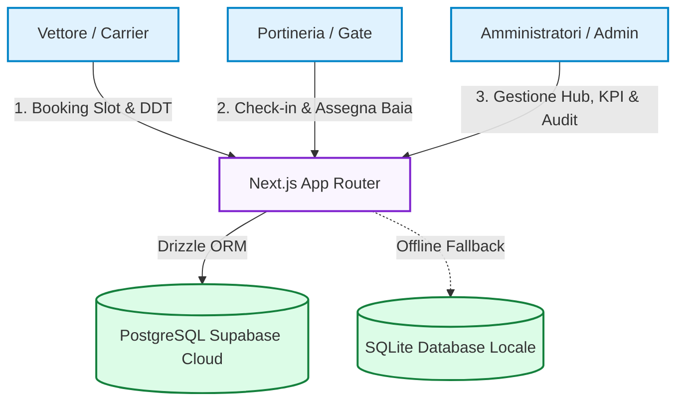
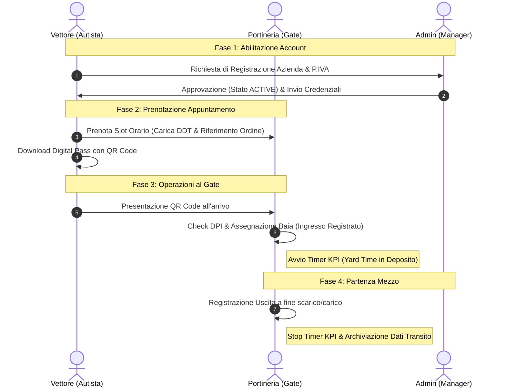

# LOGIBOOK - Project Presentation & Roadmap
> **Ecosistema di Gestione e Prenotazione Slot Logistica Uno**

Di seguito è disponibile la presentazione interattiva dello stato del progetto e delle tappe future della Roadmap, organizzata in slide sfogliabili.

---

````carousel
# 📦 Slide 1: LogiBook Overview
### *L'efficienza del magazzino comincia dal cancello d'ingresso*

**LogiBook** (in precedenza Slotify) è la nuova piattaforma enterprise di Logistica Uno progettata per ottimizzare la pianificazione e il transito dei mezzi nei depositi.

*   **Obiettivo principale**: Ridurre al minimo i tempi di attesa dei vettori ed eliminare le code ai cancelli tramite la digitalizzazione.
*   **Target di Utilizzo**: 
    1. **Vettori**: Prenotano gli slot in autonomia caricando la documentazione di viaggio (DDT).
    2. **Portineria (Gate)**: Monitora live gli arrivi, registra ingressi/uscite e assegna le baie.
    3. **Amministratori**: Gestiscono le utenze, verificano i KPI prestazionali e controllano i log di audit.

> [!NOTE]
> Il sistema adotta un'interfaccia premium ad alto contrasto con supporto Dark/Light Mode, riducendo l'affaticamento visivo degli operatori portuali.

<!-- slide -->

# 🏗️ Slide 2: Architettura Cloud-Native
### *Infrastruttura dati scalabile, resiliente e protetta*

Il diagramma illustra l'architettura tecnica e le connessioni tra le interfacce utente e i database:



*   **Database Cloud PostgreSQL**: Ospitato su Supabase per garantire ridondanza, elevata frequenza di transazioni simultanee e backup automatici.
*   **Tracciabilità Integrata**: Ogni modifica è soggetta ad audit log asincroni non bloccanti.

<!-- slide -->

# 🔄 Slide 3: Ciclo di Vita del Transito
### *Flusso operativo end-to-end del mezzo di trasporto*

Il diagramma descrive il processo dal momento dell'onboarding del vettore fino all'uscita dal magazzino:



<!-- slide -->

# ✅ Slide 4: Stato Avanzamento (Features Pronte)
### *Cosa è stato già completato e integrato nella V1*

| Area Funzionale | Stato | Dettagli Sviluppo |
| :--- | :---: | :--- |
| **Sicurezza & Onboarding** | 🟢 Completato | Gestione richieste d'accesso vettori (`PENDING`/`ACTIVE`), login a tre ruoli e cambio password obbligatorio al primo accesso. |
| **Area Vettori (Booking)** | 🟢 Completato | Calendario slot, vincolo ore 15:00 del giorno precedente, modulo emergenza SOS e gestione avanzata combinata "ENTRAMBI" con tab dedicati. |
| **Digital Pass QR** | 🟢 Completato | Download pass digitale con QR Code generato dinamicamente per velocizzare il check-in. |
| **Admin Dashboard** | 🟢 Completato | Multi-deposito rapido, heatmap saturazione mensile con "jump-to-day", statistiche volumi bancali in tempo reale ed export report in formato CSV. |
| **Gate Live Monitor** | 🟢 Completato | Lista ingressi del giorno, timer di permanenza del mezzo al gate e stampa fogli di marcia A4. |
| **Registro Audit** | 🟢 Completato | Logging asincrono e immutabile delle modifiche ai dati con visualizzazione old/new values. |

<!-- slide -->

# 🔴 Slide 5: Roadmap Futura (Must & Should)
### *Le prossime tappe chiave per il rilascio in produzione*

```
[MUST] Rilascio Immediato
├── Sostegno Multilingua (i18n): Traduzione del portale in Inglese, Polacco e Rumeno per autisti esteri.
└── Validazione Targhe/IVA: Controlli regex severi sugli input per evitare anomalie nei database.
```

```
[SHOULD] Alta Priorità
├── Notifiche Email Automatiche: Invio automatico del pass e del QR Code via mail alla prenotazione.
├── SMS Driver Call: Invio automatico di un SMS all'autista per segnalare la baia libera all'ingresso.
└── Gestione Anagrafiche da UI: Pannello Admin per aggiungere/rimuovere Baie e Hub in autonomia.
```

> [!IMPORTANT]
> Il supporto multilingua (i18n) per gli autisti è classificato come **P0 (Must)** perché l'80% delle incomprensioni e dei rallentamenti in portineria deriva da problemi linguistici al momento del check-in dei documenti.

<!-- slide -->

# 🟢 Slide 6: Visione Futura (Could & Won't)
### *Integrazioni avanzate ed evoluzioni tecnologiche (V2)*

```
[COULD] Valore Aggiunto
├── Yard Management Screen: Monitor piazzale esterno per la chiamata dei camion in attesa.
└── Webhook API WMS/ERP: Integrazione automatica con i sistemi gestionali del magazzino Logistica Uno.
```

```
[WON'T] Sviluppi Futuri (V2)
└── Integrazione OCR Gate: Telecamere di lettura targa all'ingresso per check-in automatico.
```

> [!TIP]
> L'integrazione di un tabellone Yard Management esterno riduce drasticamente l'esigenza di interazione fisica tra autista e portineria, incrementando la sicurezza del piazzale.
````

---

## 📄 Documentazione di Supporto
Per ulteriori dettagli sull'applicazione e sulle specifiche di progetto, consultare i seguenti file nel workspace:
*   [Funzionalità di LogiBook](file:///c:/Users/AlessandroBaiamonte/Desktop/progetto%20slotify/FUNZIONALITA_LOGIBOOK.txt) — Specifiche dettagliate dei moduli di sistema.
*   [Valutazione Economica](file:///c:/Users/AlessandroBaiamonte/Desktop/progetto%20slotify/valutazione_economica.md) — Analisi dei costi, ROI e opzioni di commercializzazione (SaaS, Enterprise).
