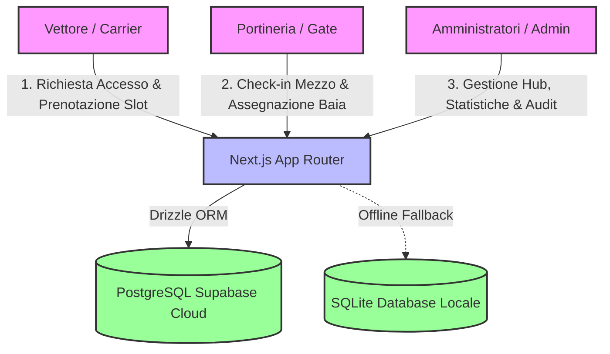
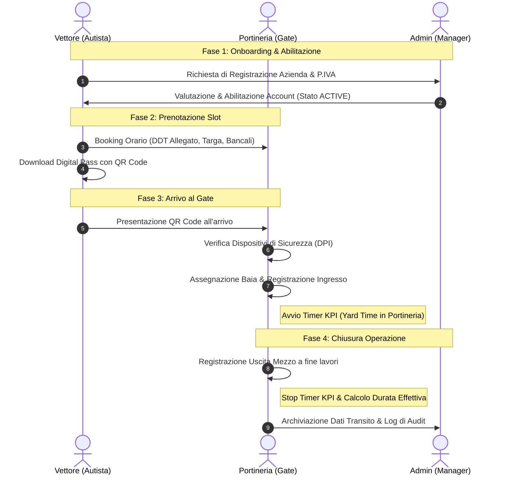

# LOGIBOOK - Project Status & Roadmap
> **Ecosistema di Gestione e Prenotazione Slot Logistica Uno**

Questo documento illustra l'architettura tecnica di **LogiBook**, riassume lo stato delle funzionalità implementate e definisce la pianificazione strategica (Roadmap) tramite il framework **MoSCoW**.

---

## 🏗️ Architettura & Flusso di Sistema

Il diagramma seguente mostra le interazioni dei diversi attori (Vettori, Amministratori e Portineria) con la piattaforma e l'infrastruttura dati.

### 🔄 Flusso Operativo del Transito Mezzi
Ecco la sequenza temporale delle azioni dal momento dell'onboarding del vettore fino al completamento delle operazioni di carico/scarico:

---

## 📊 Stato Attuale del Progetto (Implementato)

La tabella seguente riassume le macro-aree funzionali già completate e pronte per i test.

| Componente | Stato | Funzionalità Principali | Dettaglio Tecnico |
| :--- | :---: | :--- | :--- |
| **Autenticazione & Accessi** | ✅ Pronto | Accesso profilato per Vettori, Portineria e Admin. Obbligo cambio password al primo accesso. | Sessioni server-side, hash `bcryptjs`, rotte protette middleware. |
| **Onboarding Vettori** | ✅ Pronto | Modulo di richiesta d'accesso. Dashboard Admin per l'approvazione con note di rifiuto. | Tabella `users` con stati `PENDING` / `ACTIVE` / `REJECTED`. |
| **Area Vettori (Booking)** | ✅ Pronto | Calendario slot orari, prenotazione con targa/autista, gestione combinata "ENTRAMBI" con tab dedicati. | Validazione schema Zod, logica di blocco prenotazioni dopo le 15:00 del giorno precedente. |
| **Digital Pass QR** | ✅ Pronto | Generazione dinamica di QR Code contenente l'ID univoco della prenotazione. | Integrazione API esterna QR Code, layout ottimizzato per smartphone. |
| **Area Admin (Management)**| ✅ Pronto | Modifica/cancellazione prenotazioni, CRUD utenti, esportazione CSV, cruscotto KPI (volume bancali IN/OUT). | Esportatore di flussi nativo, query Drizzle per indicatori temporali e aggregazioni. |
| **Live Gate Monitor** | ✅ Pronto | Visualizzazione transiti del giorno, cronometro tempo di sosta in tempo reale, DPI checklist. | Interval refresh asincrono (30s) senza ricaricare la pagina. |
| **Registro di Audit** | ✅ Pronto | Tracciamento asincrono "fire-and-forget" delle operazioni critiche con differenze di stato. | Tabella `audit_logs` con archiviazione delta JSON (`oldValue` vs `newValue`). |

> [!IMPORTANT]
> **Sicurezza & Tracciabilità**: Ogni transito e variazione dei dati sensibili (compreso l'annullamento dei check-in o check-out) genera una traccia immutabile nel registro di audit comprensiva di IP e User-Agent.

---

## 🚦 Roadmap delle Implementazioni Future (MoSCoW)

Abbiamo classificato i prossimi sviluppi utilizzando il modello MoSCoW per delineare chiaramente la priorità di rilascio.

### 🔴 MUST (Indispensabili per il lancio in produzione)
*   **Supporto Multilingua (i18n)**:
    *   *Descrizione*: Traduzione dell'interfaccia Vettori e del Pass Digitale in **Inglese, Polacco e Rumeno**.
    *   *Motivazione*: Gli autisti dei vettori appartengono spesso a nazionalità estere; la barriera linguistica causa code e ritardi al gate.
*   **Sanitizzazione e Validazione Targhe/Partita IVA**:
    *   *Descrizione*: Controllo formale rigoroso degli input all'inserimento (regex specifiche per formati targhe europei e P.IVA).
    *   *Motivazione*: Evita l'inserimento di dati sporchi che compromettono i report di portineria.

### 🟡 SHOULD (Importanti ma non bloccanti)
*   **Invio Mail Automatico**:
    *   *Descrizione*: Invio automatico di una mail di conferma con il **Digital Pass (QR Code)** integrato o in allegato.
    *   *Motivazione*: Agevola l'autista che può mostrare il pass direttamente dalla propria app di posta senza dover rientrare nel portale.
*   **Notifiche SMS al Driver**:
    *   *Descrizione*: All'ingresso del mezzo nel piazzale di attesa, un SMS notifica l'autista sul numero di baia assegnato.
    *   *Motivazione*: Evita che l'autista debba scendere dalla cabina per chiedere istruzioni, velocizzando la viabilità interna.
*   **Pannello Configurazione Depositi**:
    *   *Descrizione*: Configurazione dinamica da interfaccia Admin del numero di baie attive, degli hub e degli orari di apertura del deposito.
    *   *Motivazione*: Attualmente tali parametri sono statici (hard-coded in `constants.ts`).

### 🟢 COULD (Valore aggiunto / Ottimizzazioni)
*   **Pannello Yard Management (Tabellone Piazzale)**:
    *   *Descrizione*: Una schermata ad alto contrasto da proiettare su monitor esterni per indicare lo stato della coda e la chiamata baia.
    *   *Motivazione*: Riduce l'affollamento in portineria indirizzando autonomamente i driver in attesa.
*   **Sincronizzazione API WMS/ERP**:
    *   *Descrizione*: Esposizione di webhook/API per segnalare al sistema WMS di deposito l'avvenuto arrivo di un mezzo al gate.
    *   *Motivazione*: Ottimizza la pianificazione del personale di magazzino in base ai transiti reali.

### ⚪ WON'T (Sviluppi futuri per la V2)
*   **Integrazione OCR (Lettura Targhe)**:
    *   *Descrizione*: Utilizzo di telecamere per la lettura ottica della targa del camion al cancello d'ingresso per effettuare il check-in automatico.
    *   *Motivazione*: Richiede investimenti hardware dedicati e integrazione con telecamere IP fisiche del magazzino.
